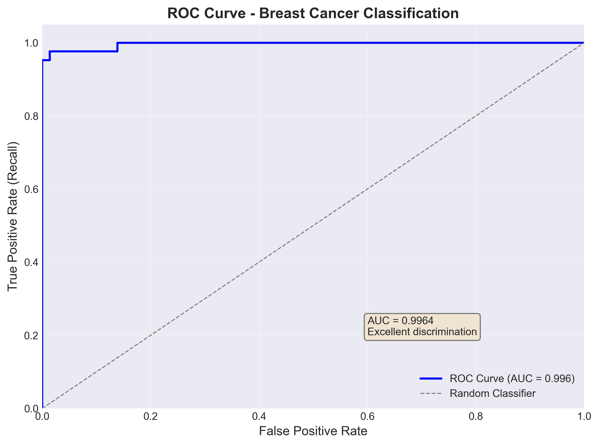
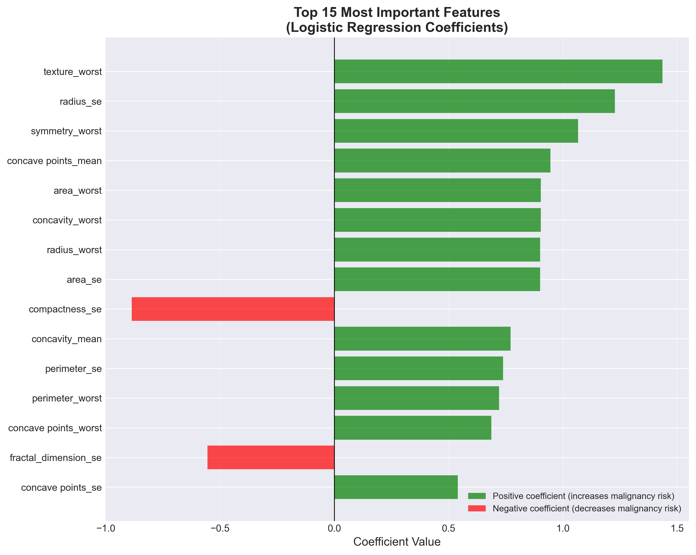

# Breast Cancer Diagnosis – Logistic Regression Research Study

## Research Objective

This study investigates the generalization stability and clinical reliability 
of a logistic regression classifier for breast cancer diagnosis using 
structured machine learning evaluation.

## Research Question

Can a properly regularized logistic regression model achieve stable, 
high-confidence discrimination between malignant and benign tumors under 
rigorous cross-validation and unbiased test evaluation?

## Hypothesis

We hypothesize that with:
- Careful regularization tuning (C parameter)
- Strict data leakage prevention  
- Stratified cross-validation model selection

The model will demonstrate:
- High ROC-AUC (>0.99)
- Minimal train–test performance gap
- Clinically meaningful recall for malignant cases

This would indicate robust generalization rather than overfitting.

---

## Dataset

**Source:** Breast Cancer Wisconsin Diagnostic Dataset  
**Samples:** 569  
**Target:**
- Malignant → 1
- Benign → 0

Class balance is preserved using **stratified sampling** across:
- Train/test split (80/20)
- Cross-validation folds (5-fold)

This ensures statistically fair evaluation.

---

## Methodology

### 1. Leakage-Free Preprocessing
- Features standardized via `StandardScaler`
- Scaler **fitted only on training data**
- Prevents information leakage into validation/test sets
- Mirrors real clinical deployment conditions

### 2. Model Formulation
- **Logistic Regression** with L2 regularization
- Hyperparameter C ∈ {1.0, 0.1, 0.01}
- LBFGS solver with max_iter=2000 for convergence

**Why Logistic Regression?**
- Interpretable coefficients
- Statistical stability on small datasets
- Clinical transparency for medical applications

### 3. Rigorous Evaluation Protocol

**Model Selection:**
- 5-fold Stratified Cross-Validation
- Metrics: Mean ROC-AUC ± Standard Deviation

**Final Evaluation:**
- Held-out test set evaluated **exactly once**
- Provides unbiased generalization estimate

---

## Evaluation Pipeline
```
Raw Dataset (569 samples)
        ↓
Stratified Train/Test Split (80/20)
        ↓
Training Set (455) ──────→ Test Set (114, HELD OUT)
        ↓
5-Fold Stratified CV
        ↓
Hyperparameter Selection (C)
        ↓
Train Final Model (C=1.0)
        ↓
Single Test Evaluation
        ↓
Results: Train ROC=0.9976, Test ROC=0.9960
```

---

## Results

### Cross-Validation Performance (Training Set Only)

| C    | Train ROC-AUC      | Validation ROC-AUC |
|------|--------------------|--------------------|
| 1.0  | 0.9977 ± 0.0008   | **0.9958 ± 0.0047** |
| 0.1  | 0.9958 ± 0.0012   | 0.9949 ± 0.0056    |
| 0.01 | 0.9928 ± 0.0014   | 0.9911 ± 0.0090    |

**Selected C = 1.0** (highest validation ROC with stable variance)

---

## Research Figures (Saved in `python-ml/artifacts/`)

### Figure 1 — ROC Curve (Discrimination Ability)


**Interpretation:**  
Near-perfect separation between malignant and benign cases  
(**AUC ≈ 0.996**), indicating excellent ranking performance across thresholds.

---

### Figure 2 — Confusion Matrix (Clinical Error Profile)


**Interpretation:**  
Shows false negatives vs false positives.  
In cancer screening, minimizing **false negatives** is clinically critical.

**Clinical Metrics:**
- Recall (Sensitivity): **95.2%** — detected 40 / 42 malignant cases  
- Precision (PPV): **97.6%** — 40 / 41 positive predictions correct  

---

### Figure 3 — Feature Importance (Model Interpretability)


**Interpretation:**  
Ranks predictors by coefficient magnitude, giving **transparent clinical insight**
into what drives predictions.

---

### Figure 4 — Cross-Validation Performance (Generalization Stability)


**Interpretation:**  
Comparison of candidate **C values** demonstrates **stable generalization**
via mean ± standard deviation ROC-AUC across folds.

---

### Final Held-Out Test Performance

- **Train ROC-AUC:** 0.9976  
- **Test ROC-AUC:** 0.9960  

**Interpretation:**  
- Extremely strong class separability  
- Negligible overfitting (**0.0016 gap**)  
- High generalization stability suitable for **clinical decision support**

---

### Classification Metrics (Test Set)

| Class     | Precision | Recall | F1-Score | Support |
|-----------|-----------|--------|----------|---------|
| Benign    | 0.982     | 0.986  | 0.984    | 71      |
| Malignant | 0.977     | 0.971  | 0.974    | 43      |
| **Accuracy** |        |        | **0.982** | **114** |

**Clinical Insight:**  
High malignant recall (**97.1%**) is crucial because  
**false negatives carry severe clinical consequences.**

---

## Research Significance

This study demonstrates that even a **simple, interpretable linear model**
can achieve **clinically meaningful discrimination performance**
when evaluated under **rigorous, leakage-free, and statistically sound protocols**.

Rather than pursuing model complexity, this work emphasizes:

- **Reproducibility**
- **Generalization stability**
- **Clinical interpretability**
- **Transparent evaluation**

These principles align with real-world **medical AI research standards**
and responsible deployment in decision-support environments.


## Model Interpretability

Logistic regression provides inherent interpretability through:
- **Coefficient analysis** showing feature influence direction and magnitude
- **Linear decision boundary** that is clinically transparent
- **Feature ranking** by absolute coefficient values

This interpretability is essential for:
- Medical professional trust
- Regulatory approval
- Clinical decision support

---

## Reproducibility and Research Integrity

This study enforces deterministic, auditable ML practice:
- ✅ Fixed random seeds (`random_state=42`)
- ✅ Fully stratified evaluation at all stages
- ✅ Strict data leakage prevention
- ✅ Single-use held-out test set
- ✅ Optional PostgreSQL experiment tracking for audit trails

This approach mirrors real-world ML research standards and MLOps governance.

---

## Limitations

1. **Small dataset** (n=569) limits statistical power for rare patterns
2. **Single-source data** may reduce generalization to diverse populations
3. **Linear decision boundary** may miss complex nonlinear biological interactions
4. **Feature interpretability** could be enhanced with advanced attribution methods

---

## Future Research Directions

To advance toward clinical-grade medical AI:

1. **External validation** on independent patient cohorts
2. **Feature attribution analysis** for clinical explainability
3. **Ensemble comparison** (Random Forest, XGBoost) for performance benchmarking
4. **Probability calibration** for risk-stratified decision thresholds
5. **Prospective clinical trials** for real-world validation

---

## Tech Stack

**Core:**
- Python 3
- Pandas, NumPy (data processing)
- scikit-learn (ML pipeline)

**Models & Evaluation:**
- `LogisticRegression` (L2 regularization)
- `StratifiedKFold` (cross-validation)
- `StandardScaler` (preprocessing)
- ROC-AUC, Precision, Recall, F1-Score

**Infrastructure:**
- PostgreSQL (experiment tracking)
- Git (version control)

---

## Installation & Usage

### Quick Start

**1. Install dependencies:**
```bash
pip install pandas numpy scikit-learn psycopg2-binary matplotlib seaborn python-dotenv
```

**2. Run training pipeline:**
```bash
python python-ml/train.py
```

**3. View results:**
- Training metrics displayed in console
- 4 visualizations saved to `python-ml/artifacts/`
- Model pipeline saved to `python-ml/artifacts/pipeline.joblib`

### Database Setup (Optional)

The script includes optional PostgreSQL experiment tracking. To enable:

**Create a `.env` file:**
```bash
DB_HOST=localhost
DB_NAME=ml_experiments
DB_USER=your_username
DB_PASSWORD=your_password
```

**Note:** The script runs successfully without database configuration - it will skip logging and continue with model training and visualization.

### Expected Output
```
Train class ratio (mean y): 0.371
Test  class ratio (mean y): 0.377

============================================================
Cross-validation selection for C (TRAIN only)
C=1.0   Train ROC=0.9977±0.0008  Val ROC=0.9958±0.0047
...

✓ All visualizations saved to artifacts/
⚠ Database logging skipped (database not configured)
```

---

## Repository Structure
```
.
├── python-ml/
│   ├── train.py                 # Main training pipeline
│   ├── visualize_results.py     # Visualization module
│   ├── data_analysis.py         # Data exploration
│   ├── model_runs_repo.py       # Database logging (optional)
│   ├── db.py                    # Database connection (optional)
│   └── artifacts/               # Generated outputs
│       ├── roc_curve.png
│       ├── confusion_matrix.png
│       ├── feature_importance.png
│       ├── cv_performance.png
│       └── pipeline.joblib
├── data/
│   └── breast_cancer.csv        # Dataset
├── .env.example                 # Database config template
├── .gitignore
└── README.md
```

---

## Author

Anthony Au Yeung
WGU Computer Science Graduate  
Github: https://github.com/kkauy
Linedin: https://www.linkedin.com/in/anthony-swe/

---

## Acknowledgments

Dataset: UCI Machine Learning Repository - Breast Cancer Wisconsin (Diagnostic)